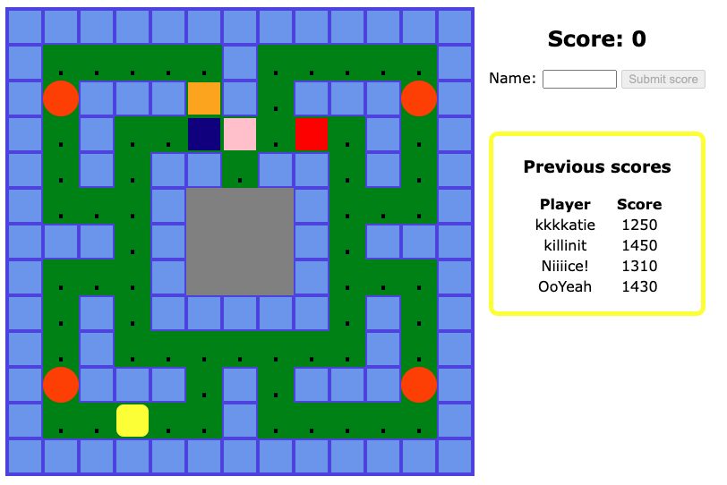

This is a PACMAN game with the option to submit your score at the end which is added to the list of players and scores already saved.

The game itself is built with vanilla JS, HTML and CSS and I used Ania Kubow's work as a starting point and a guide at times as I went throug: https://github.com/kubowania/pac-man. I used Firebase to store game scores of previous players.

